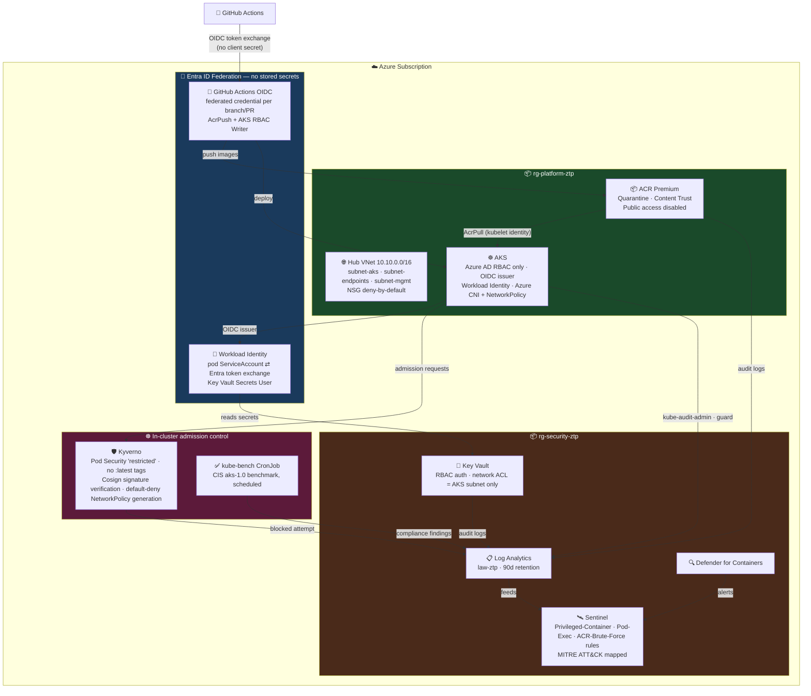
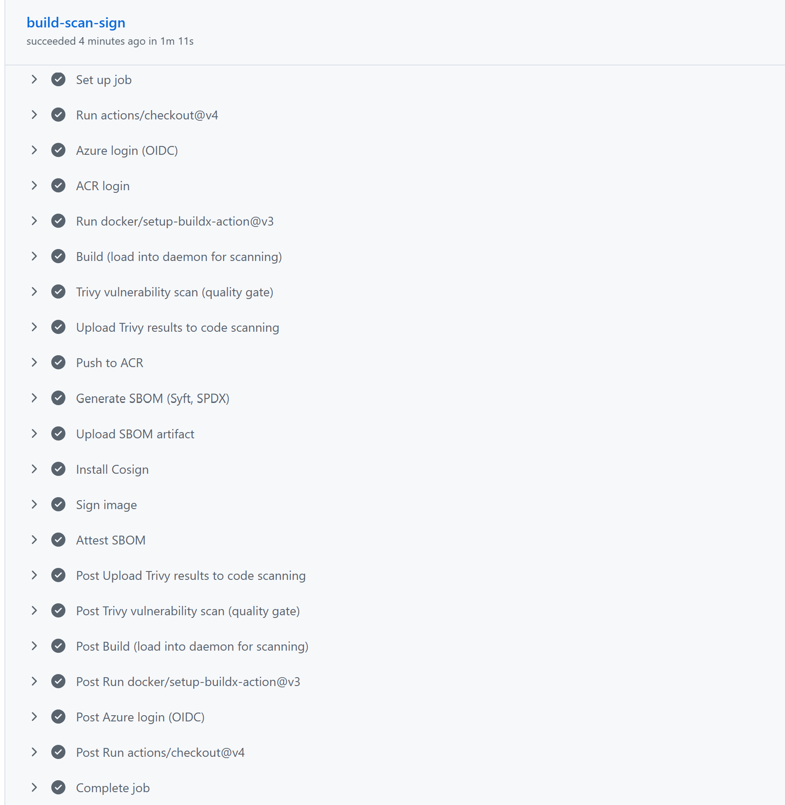
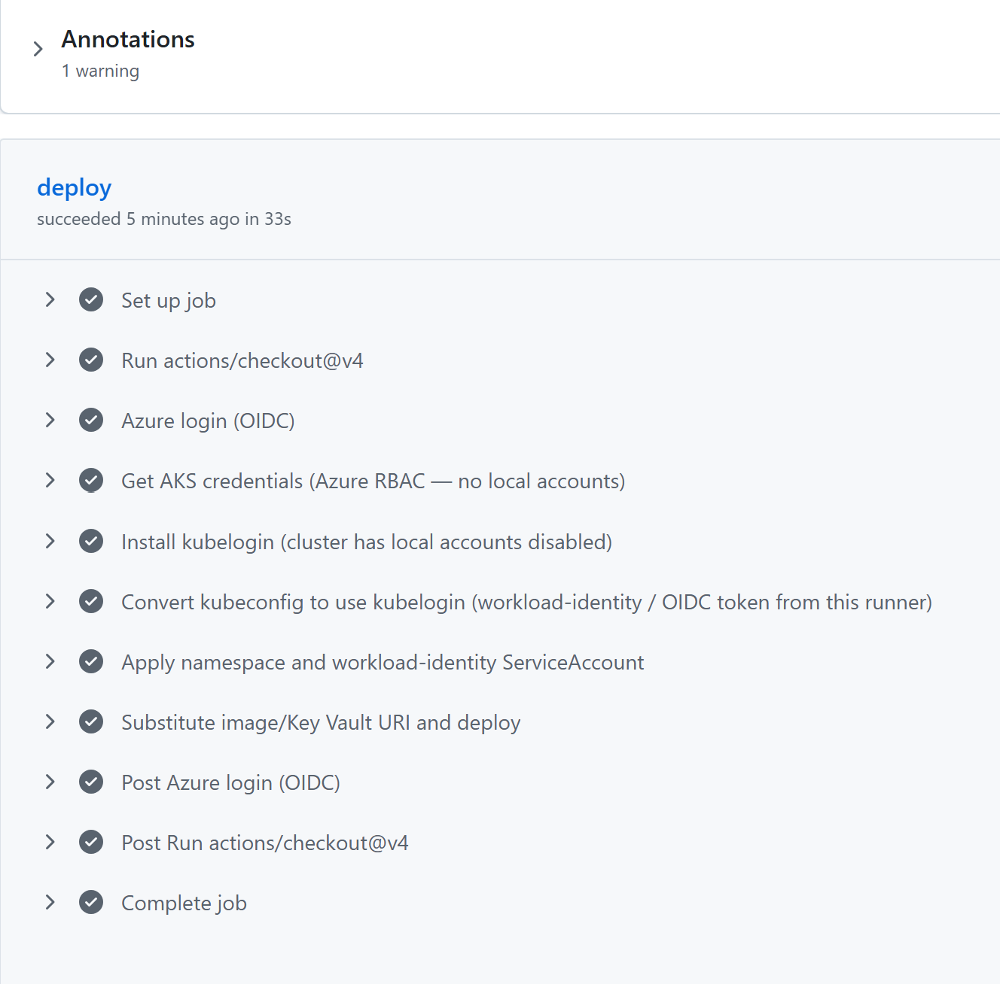
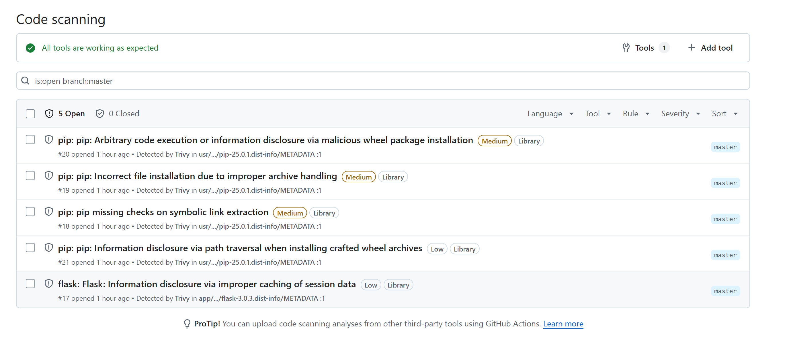
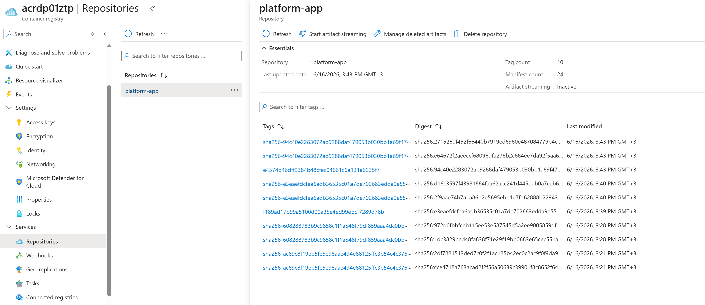
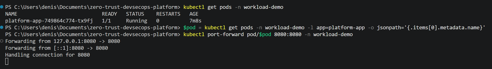
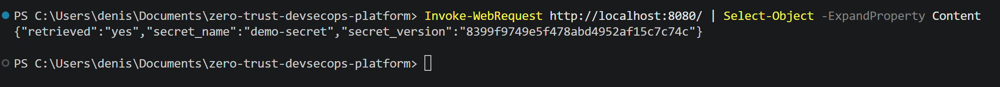

# Zero Trust DevSecOps Platform

An end-to-end Zero Trust platform on Azure Kubernetes Service, built with Terraform:
secure infrastructure → keyless CI/CD → supply-chain verification → in-cluster
admission control → detection & response → continuous compliance. Designed as a
reference architecture and incident-response demo.

> Live deployment validated end-to-end on Azure (June 2026): Terraform-provisioned infrastructure,
> full CI/CD supply-chain pipeline (scan → sign → deploy), and workload identity reading a Key Vault
> secret — all verified with screenshots below.

## Architecture



## Live Deployment Evidence

The architecture above was deployed end-to-end on Azure (47 resources via
`terraform apply`), exercised through both demo scenarios, and torn down to
stay inside the trial budget. Screenshots below are from that live run.

### Supply-chain CI/CD pipeline

| | |
|---|---|
|  | `build-scan-sign` workflow: **all 14 steps green** — OIDC login → build → Trivy scan → SARIF upload → push to ACR → SBOM (Syft/SPDX) → Cosign sign + attest SBOM. No client secret used anywhere. |
|  | `deploy` workflow (triggered automatically on build success): kubelogin with Azure RBAC (no local accounts) → `kubectl apply` → rollout confirmed. Kyverno **verified the Cosign signature** before admitting the pod. |

### Vulnerability scanning — results in GitHub Security



Trivy found 5 findings in `pip` and `flask` dependencies — **Medium/Low**, all unfixed upstream. Results surface directly in the GitHub Security tab (SARIF upload). The pipeline continues (`exit-code: 0` + `ignore-unfixed`) so known-unfixable CVEs don't block shipping; the findings are tracked and visible.

### Signed image in ACR



ACR `platform-app` repository: commit-SHA image tags (e.g. `e4574d46...`, `f189ad17...`) each have a corresponding `sha256-<digest>` OCI artifact — the **Cosign signature** stored alongside the image. Kyverno's `verify-image-signatures` ClusterPolicy checks this artifact at admission time and rejects any unsigned image.

### Zero Trust workload identity — pod reads Key Vault secret

| | |
|---|---|
|  | `platform-app` pod: **1/1 Running**, 0 restarts. Port-forwarded to `localhost:8080`. |
|  | `GET /` → `{"retrieved":"yes","secret_name":"demo-secret","secret_version":"8399f9..."}`. The pod exchanged its projected ServiceAccount token for an Entra ID token and read the secret — **no connection string, no API key, nothing stored in the container**. |

### Identity & access — no local accounts, no standing secrets

| | |
|---|---|
|  | AKS cluster: **Microsoft Entra ID authentication with Azure RBAC**, "Kubernetes local accounts" disabled, OIDC issuer + Workload Identity enabled. |
|  | Key Vault IAM: the workload's managed identity has exactly **Key Vault Secrets User** — nothing more. |
|  | GitHub Actions app registration: **0 client secrets**, 2 OIDC federated credentials — CI/CD authenticates without storing any password. |

### Hardened platform

| | |
|---|---|
|  | ACR Premium tier with quarantine + retention policies. |
|  | ACR public network access **Disabled** — image pulls only via the AKS subnet. |
|  | Microsoft Defender for Containers plan **On**, covering the registry and cluster. |

### Detection — Kyverno denial → Sentinel incident, mapped to MITRE ATT&CK

| | |
|---|---|
|  | 4 custom Sentinel analytics rules, severities High/Medium. |
|  | `ZTP-Privileged-Container-Blocked`: MITRE ATT&CK **T1610 / T1611**, 5-minute query frequency. |
|  | Raw audit trail: Kyverno denying `attacker-privileged-probe` for violating 9 Pod Security policies. |
|  | The resulting **Sentinel incident** — Severity: High, Status: Active — created automatically. |

## Terraform Modules

| Module | Sprint | Description |
|---|---|---|
| `governance` | 1 | `rg-platform-ztp` / `rg-security-ztp` resource groups with CanNotDelete locks |
| `networking` | 1 | Hub VNet `10.10.0.0/16`, subnets for AKS / private endpoints / mgmt, deny-by-default NSGs |
| `acr` | 1 | Premium ACR — quarantine policy, content trust, retention, no public access |
| `key-vault` | 1 | RBAC-authorized Key Vault, purge protection, network ACL scoped to the AKS subnet |
| `aks` | 1 | AKS cluster — Entra ID + Azure RBAC only (`local_account_disabled`), OIDC issuer, workload identity, Azure CNI with network policy, separate system/user node pools, kubelet AcrPull |
| `github-oidc` | 2 | `azuread_application` + federated credentials (branch + pull_request subjects) — GitHub Actions authenticates with no client secret; scoped to AcrPush + AKS RBAC Writer |
| `workload-identity` | 2 | User-assigned identity + federated credential bound to a Kubernetes ServiceAccount; Key Vault Secrets User role — pods exchange their projected token for an Entra ID token directly |
| `monitoring` | 5 | Log Analytics workspace + diagnostic settings for AKS (`kube-audit-admin`, `guard`), ACR, and Key Vault |
| `defender` | 5 | Defender for Containers plan + workspace association |
| `sentinel` | 5 | Workspace onboarding + 4 KQL analytics rules mapped to MITRE ATT&CK: privileged-container-blocked (T1610/T1611), pod-exec-attempts (T1609), ACR-auth-failures (T1110), Key Vault secret enumeration (T1552) |
| `kyverno` | 4 | Helm-installed Kyverno + baseline Pod Security "restricted" policies, plus custom ClusterPolicies: disallow `:latest` tags, Cosign signature verification, auto-generated default-deny NetworkPolicy per namespace |
| `kube-bench` | 6 | Scheduled CronJob running the CIS `aks-1.0` benchmark against every node |

## Sprint Roadmap

1. **Foundation** — VNet, NSG, AKS, ACR, Key Vault ✅ (Terraform written)
2. **Keyless CI/CD** — GitHub → Azure OIDC federation, AKS Workload Identity, Key Vault access ✅ (Terraform written)
3. **Supply chain gates** — Checkov, Trivy, Quality Gates, SBOM, Cosign signing (CI workflows — not yet written)
4. **Admission control** — Kyverno: VerifyImages, no `:latest` tags, no privileged containers, NetworkPolicies, namespace isolation ✅ (Terraform written)
5. **Detection** — Defender for Containers, Sentinel, audit logs, analytics rules, KQL ✅ (Terraform written)
6. **Compliance as Code** — CIS Benchmark via kube-bench ✅ (Terraform written)
7. **Incident Response Demo** — simulate a privileged-container deploy attempt → Kyverno blocks it → Sentinel raises an incident → MITRE ATT&CK mapping walkthrough (demo runbook — not yet written)

## MITRE ATT&CK coverage

Every Sentinel rule (`modules/sentinel`) and admission-control denial
(`modules/kyverno`) maps to a specific technique, so detections can be
discussed in terms reviewers recognize:

| Scenario | Tactic | Technique | Caught by |
|---|---|---|---|
| Privileged / host-mounted pod deploy | Privilege Escalation | T1610 — Deploy Container | Kyverno (deny) → `ZTP-Privileged-Container-Blocked` |
| Container escape attempt (`hostPID`/`hostNetwork`/`hostPath`) | Defense Evasion | T1611 — Escape to Host | Kyverno (deny) → `ZTP-Privileged-Container-Blocked` |
| Repeated `kubectl exec` into pods | Execution, Lateral Movement | T1609 — Container Administration Command | `ZTP-Pod-Exec-Attempts` |
| Repeated failed ACR logins | Credential Access | T1110 — Brute Force | `ZTP-ACR-Auth-Failures` |
| Burst of Key Vault `SecretGet` calls | Credential Access | T1552 — Unsecured Credentials | `ZTP-KeyVault-Secret-Enumeration` |
| East-west traffic from a pod with no granted NetworkPolicy | Lateral Movement | T1210 — Exploitation of Remote Services (blocked) | Kyverno default-deny NetworkPolicy — see [docs/NETWORK_POLICY_DEMO.md](docs/NETWORK_POLICY_DEMO.md) |

## Continuous Security (Sprint 3+)

Every push/PR runs through a layered set of free, open-source scanners before
anything reaches ACR or the cluster:

```
Commit
  → Gitleaks        (secret scanning — .github/workflows/gitleaks.yml)
  → Checkov         (IaC misconfiguration — terraform-ci.yml)
  → Trivy           (image vulnerability quality gate — build-scan-sign.yml)
  → Syft            (SBOM generation — build-scan-sign.yml)
  → Cosign          (image signing + SBOM attestation — build-scan-sign.yml)
  → Dependabot      (dependency/base-image/provider version PRs — dependabot.yml)
  → Deploy
```

`Dependabot` runs on a weekly schedule across four ecosystems: the Flask
app's `pip` requirements, the `Dockerfile` base image, Terraform provider/module
versions, and the GitHub Actions used by these workflows themselves.

## Zero Trust principles applied

- **No standing credentials**: GitHub Actions and in-cluster workloads authenticate via
  OIDC token exchange (`github-oidc`, `workload-identity`) — nothing to leak, rotate, or
  expire.
- **No local cluster accounts**: `local_account_disabled = true` on AKS — every human and
  pipeline identity goes through Entra ID + Azure RBAC, scoped per-resource.
- **Least privilege by construction**: kubelet gets `AcrPull` only, the CI identity gets
  `AcrPush` + RBAC Writer only, workload identities get `Key Vault Secrets User` (read,
  no list/manage) only.
- **Deny by default**: NSGs deny inbound by default, Key Vault network ACLs allow only the
  AKS subnet, Kyverno auto-generates a default-deny `NetworkPolicy` for every new namespace.
- **Verify explicitly, continuously**: Kyverno enforces image provenance (no `:latest`,
  Cosign signatures) at admission time; kube-bench re-checks CIS compliance on a schedule;
  Sentinel correlates audit logs into MITRE-mapped incidents in near real time.

## Repo layout

```
terraform/    root wiring — init/plan/apply lives here
modules/      one module per concern (see table above)
.github/workflows/
  terraform-ci.yml      fmt · validate · tflint · Checkov on every PR touching Terraform
  build-scan-sign.yml   build → Trivy quality gate → Syft SBOM → Cosign sign + attest
  deploy.yml            OIDC login → kubelogin → kubectl apply (runs after a successful build)
app/          minimal Flask demo workload — proves the workload-identity → Key Vault chain
demo/
  privileged-pod-attempt.yaml     Sprint 7 trigger: the pod Kyverno is supposed to block
  workload-identity-demo/         namespace + ServiceAccount + Deployment for the demo workload
  network-policy-demo/            namespace-a + frontend/backend/attacker-pod + NetworkPolicy
docs/
  CONVERSATION_LOG.md             history of how this project came to be
  INCIDENT_RESPONSE_DEMO.md       Sprint 7 runbook — attack → block → audit → Sentinel → MITRE
  NETWORK_POLICY_DEMO.md          east-west Zero Trust demo — frontend reaches backend, attacker doesn't
  DEFENDER_ALERT_DEMO.md          Defender for Containers alert → Sentinel incident
  DEMO_CHECKLIST.md               ordered screenshot list for a create → demo → destroy session
scripts/powershell/
  Generate-CosignKeys.ps1         one-time Cosign key pair generation
  Get-AksCredentials.ps1          az aks get-credentials + kubelogin convert, wrapped
  Start-DemoEnvironment.ps1       apply + configure kubectl + fire the Sprint 7 trigger + print the checklist
  Stop-DemoEnvironment.ps1        terraform destroy wrapper
```

## Getting started

```bash
cd terraform
cp terraform.tfvars.example terraform.tfvars   # fill in subscription_id, github_org/repo, ACR suffix, admin group IDs
terraform init
terraform plan
terraform apply
```

`kubernetes`/`helm` providers authenticate to AKS through `kubelogin` (required because
the cluster has local accounts disabled and is Azure-RBAC-only) — install it with
`az aks install-cli` before applying the `kyverno` / `kube-bench` modules. Once
applied, `scripts/powershell/Get-AksCredentials.ps1 -ResourceGroup rg-platform-ztp
-ClusterName aks-ztp` sets up `kubectl` for your own Entra ID identity.

## Wiring up CI/CD (Sprint 3)

The workflows in `.github/workflows/` need these **repo variables** (Settings →
Secrets and variables → Actions → Variables) — all of them come straight out of
`terraform output` once applied:

| Variable | Source |
|---|---|
| `AZURE_CLIENT_ID` | `terraform output -raw github_actions_client_id` |
| `AZURE_TENANT_ID`, `AZURE_SUBSCRIPTION_ID` | `az account show` |
| `ACR_NAME`, `ACR_LOGIN_SERVER` | `terraform output -raw acr_login_server` (name = part before the first dot) |
| `AKS_RESOURCE_GROUP`, `AKS_CLUSTER_NAME` | `rg-platform-ztp`, `aks-ztp` |
| `KEY_VAULT_URI` | `terraform output -raw key_vault_uri` |
| `WORKLOAD_NAMESPACE`, `WORKLOAD_IDENTITY_CLIENT_ID` | `var.workload_namespace` (default `workload-demo`), `terraform output -raw workload_identity_client_id` |

And these **repo secrets** (generate once with `scripts/powershell/Generate-CosignKeys.ps1`):

| Secret | Source |
|---|---|
| `COSIGN_PRIVATE_KEY` | contents of the generated `cosign.key` |
| `COSIGN_PASSWORD` | the password you chose when generating the key pair |

No `AZURE_CLIENT_SECRET` anywhere — that's the entire point of `modules/github-oidc`.

## Running the incident response demo (Sprint 7)

Once the cluster is up and `kubectl` is configured:

```bash
kubectl apply -f demo/workload-identity-demo/   # gives the platform something legitimate to compare against
kubectl apply -f demo/privileged-pod-attempt.yaml
```

Then follow [docs/INCIDENT_RESPONSE_DEMO.md](docs/INCIDENT_RESPONSE_DEMO.md) to trace
the block through Kyverno → audit logs → Sentinel incident → MITRE ATT&CK mapping.

Two more demos, same pattern:

- [docs/NETWORK_POLICY_DEMO.md](docs/NETWORK_POLICY_DEMO.md) — Zero Trust
  east-west traffic: `frontend` reaches `backend`, `attacker-pod` doesn't,
  enforced by Kyverno's auto-generated default-deny NetworkPolicy.
- [docs/DEFENDER_ALERT_DEMO.md](docs/DEFENDER_ALERT_DEMO.md) — Defender for
  Containers alert flowing into the same Sentinel workspace as the Kyverno
  incidents above.

## "Create → screenshot → destroy" — staying inside the trial budget

A few resources (ACR Premium, Defender) bill by the calendar day regardless of
runtime, but most of the cost (AKS nodes, Load Balancer, Standard SLA tier) is
per-second — so a short-lived session costs roughly **$2-5** instead of the
**$300-450/month** a 24/7 cluster would run. Repeat as many times as you need:

```powershell
.\scripts\powershell\Start-DemoEnvironment.ps1   # apply, configure kubectl, fire the Kyverno trigger, print checklist
# ... work through docs/DEMO_CHECKLIST.md (~15-20 min) ...
.\scripts\powershell\Stop-DemoEnvironment.ps1    # terraform destroy
```
